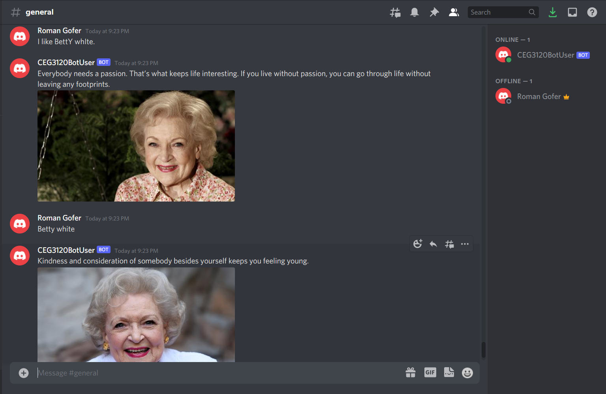

# Research and Documentation for CEG 3120 Project 1

- Setup

  - To get an API token: After creating the bot and adding it to my guild, I went to the Discord developer portal website and clicked on "Bot" under
    "Settings." Under "BUILD-A-BOT" where it says "TOKEN", I clicked the copy button. This copies the API token to the clipboard.

  - Where to put API token to work with the code: The bot.py file includes modules and functions that work with .env files. This means a .env file 
    needs to be created in the same directory as the bot.py file. Once a new .env file is created, the following needs to be typed in the file:

                                                            ``` 
                                                            # .env
                                                            DISCORD_TOKEN=paste-token-here

                                                             ```

  - This will allow the bot.py code to work with the API token from Discord.
  
  - Another important note for this token is the `.env` file should be added to the `.gitignore` file in the git repository so the `.env` file does not
    accidentally get pushed to GitHub. This will lead to the token not working anymore.

  - Dependencies: The biggest dependency for this bot to run is `python3`, which was already installed on my system. What I first installed was the right version of Pip (Python package manager) on my system by running the following commands: `sudo apt-get update`,
    `sudo apt-get upgrade`, and `sudo apt install python3-pip`. This was not on my system originally, so I had to do this before I was able to start
    installing all the necessary packages.

   - After this, the discord.py library needed to be installed on my system, which I did by running `pip3 install -U discord.py`.

   - The other library necessary for the bot to work was the `dotenv` one. I installed this by running `pip3 install -U python-dotenv`.  

- Usage

  - What commands can be typed in my Discord server: Any command with "Betty White" in it can be typed in, and the case of the letters does not matter, and a
    sentence can be typed in. As long as "Betty White" is somewhere in the input text as one name in this order, the bot will respond, regardless of case. It     can be "Betty White", "betty white", "beTtY wHiTe", etc. However, commands that have "Betty" and "White" out of order or separated by other words in
    between will not work.

  - What response the commands will provide from the bot: The bot will send a randomly chosen quote from Betty White from the quotes entered into the list of
    Betty White quotes in the bot.py code. Also, it will send a randomly chosen picture of Betty White from the `images` folder inside the `Discord-Bot`
    folder along with the quote.

- Screenshot of Bot Working

  Below is a screenshot of my bot output after commands were typed in the server:

  

- Research

  - One possible solution to keep the bot running is to host it on a server/remote computer in the Cloud that is always on. This could be done with
    the AWS system used for this course, but there is only a finite amount of money set aside for these systems, so the money would likely run out
    quickly and the system would not stay on very long before shutting down.

  - An AWS cloud system that was on an unlimited use plan and kept on longer would be able to keep the bot running 24/7.

  - Another cloud hosting option I found was Heroku, which allows users to obtain a VPS (Virtual Private Server) for free.

  - There are other inexpensive cloud-hosting services available that cost around $5/month.

  - A raspberry pi can also be used to host a Discord bot and keep it running since it is a smaller, more basic type of computer but still
    functional enough to be online and hosting a bot. As long as it is always connected to a power source, a Discord bot will be able to run
    on it 24/7.

  - [Link where I found these possible solutions](https://stackoverflow.com/questions/64388307/how-to-make-your-discord-bot-always-active)

- GitHub - Screenshot for proof of other branch for testing:

   
